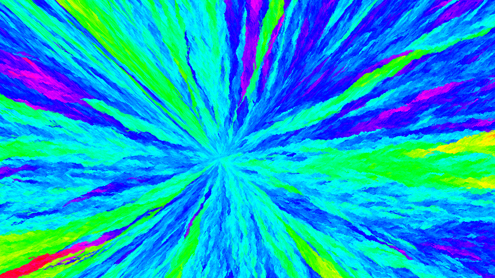
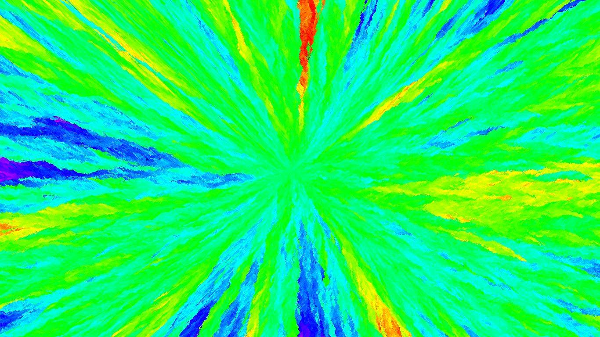

# flower-CA
Cellular automata with flowers.

# Cellular Automata (CA)

Cellular Automata (CA) is a fascinating concept in the field of computer science and mathematics. It's a computational model composed of a grid of cells, each of which can exist in various states. These cells evolve over discrete time steps following a set of rules, creating complex and often unpredictable patterns from simple initial conditions.

## How Does this Cellular Automaton Work?

- This automaton is displayed on a 2D grid.
- Each cell can exist in one of two states: "plant" or "dead."
- During each generation, plants spread to nearby empty cells with slightly different colors.
  

## How to Use

- Run the program to observe the automaton's evolution.
- Click on the grid plant flowers.
- Press the spacebar to clear the grid.
- Press Esc to exit the program.
- You can change the cell size for better pictures, but it may slow down the program.
- You can change the window size to speed up the program. By default, it's fullscreen.
- The grid resets every 17 seconds. You can disable this by setting "reset = False."
